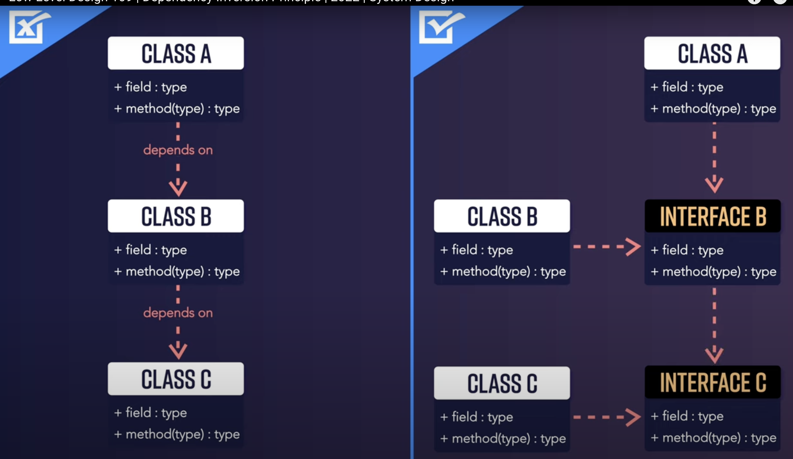

In a traditional setup, a high-level class might directly depend on a low-level class:
# Dependency Inversion
High level classes should not depend on the lower level/concrete classes. Instead, depend on the high level interfaces/abstract classes.

## Explanation
MailerInterface: This interface defines a contract that any mailer class must fulfill.
Mailer: The concrete implementation of MailerInterface.
UserRegistration: The high-level class now depends on MailerInterface rather than Mailer. This allows for more flexibility and easier testing.

By using the Dependency Inversion Principle, the UserRegistration class is decoupled from the specific implementation of the mailer.
This allows you to easily swap out the Mailer class with another implementation (e.g., a mock mailer for testing or a different mailer service) without modifying the UserRegistration class.

## Note:
Dependency Injection is one of the design patterns to implement the Dependency Inversion principle

